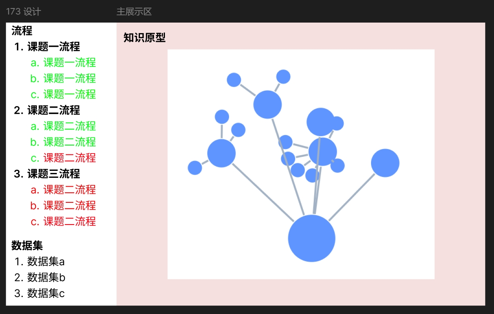

<!--
 * @Author: Cishenn Lee
 * @Date: 2025-03-21 09:38:18
 * @LastEditTime: 2025-03-28 13:01:03
 * @FilePath: \lcre\README.md
 * @Description: 
-->
This is a [Next.js](https://nextjs.org) project bootstrapped with [`create-next-app`](https://nextjs.org/docs/app/api-reference/cli/create-next-app).

## Getting Started

First, run the development server:

```bash
npm run dev
# or
yarn dev
# or
pnpm dev
# or
bun dev
```

Open [http://localhost:3000](http://localhost:3000) with your browser to see the result.

You can start editing the page by modifying `app/page.tsx`. The page auto-updates as you edit the file.

This project uses [`next/font`](https://nextjs.org/docs/app/building-your-application/optimizing/fonts) to automatically optimize and load [Geist](https://vercel.com/font), a new font family for Vercel.

## Learn More

To learn more about Next.js, take a look at the following resources:

- [Next.js Documentation](https://nextjs.org/docs) - learn about Next.js features and API.
- [Learn Next.js](https://nextjs.org/learn) - an interactive Next.js tutorial.

You can check out [the Next.js GitHub repository](https://github.com/vercel/next.js) - your feedback and contributions are welcome!

## Deploy on Vercel

The easiest way to deploy your Next.js app is to use the [Vercel Platform](https://vercel.com/new?utm_medium=default-template&filter=next.js&utm_source=create-next-app&utm_campaign=create-next-app-readme) from the creators of Next.js.

Check out our [Next.js deployment documentation](https://nextjs.org/docs/app/building-your-application/deploying) for more details.


## 原型系统设计说明

### 1. 原型开发平台
**平台名称**：Figma（基于浏览器的协作式界面设计工具）  
**选用理由**：支持版本历史追溯、团队实时协作与设计规范管理

---

### 2. 项目访问权限控制
| 权限类型       | 访问方式                          | 安全措施                     |
|----------------|-----------------------------------|------------------------------|
| 设计团队协作   | [受限邀请链接](https://www.figma.com/team_invite/redeem/ixBqdJpeUUNJ7cjGFI6YoS) | • 暂时公开           |
| 只读评审权限   | [公开原型演示](https://www.figma.com/design/Jvtg742EAKRE1jhbtEEIBx/Untitled?node-id=0-1&p=f&t=8F87cugkhtpnj2YO-0) | • 禁用导出/下载功能<br>• 动态水印跟踪 |

---

### 3. 图形化组件规范

[AntV X6 图编辑引擎](https://x6.antv.antgroup.com/examples)

[Echarts 图表](https://echarts.apache.org/examples/zh/index.html)



### 部署
暂不